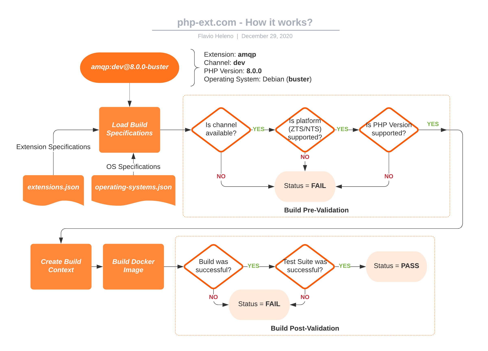

# php-ext.com

[php-ext.com](https://php-ext.com) is a PHP Extension Compatibility Monitoring portal.

This project is *heavily* inspired on [this blog post](https://blog.remirepo.net/post/2020/09/21/PHP-extensions-status-with-upcoming-PHP-8.0).

## How it works?



The diagram above describes the under-the-hood work that is done by this project.

To put it in simple terms, it takes for instance the following combination `amqp:dev@8.0.0-buster`.

The combination is composed by:
- Extension: **amqp**
- Channel: **dev**
- PHP Version: **8.0.0**
- OS: Debian (**buster**)

Once a combination is selected to be tested, a pipeline is started and the first step is to load the Extension Specifications, which provides details such as required OS packages (`librabbitmq-dev` on Debian) and any other possible dependencies to be installed prior to building the extension.

**Extension Specification for `amqp`:**

```json
{
  "amqp": {
    "build": {
      "deps": {
        "alpine": [
          "rabbitmq-c-dev"
        ],
        "buster": [
          "librabbitmq-dev"
        ]
      },
      "flag": "--with-amqp",
      "type": "git",
      "url": "https://github.com/php-amqp/php-amqp"
    },
    "require": {
      "min": "5.6.0"
    },
    "summary": "Communicate with any AMQP compliant server"
  }
}
```

The next step is to load the OS Specifications, that provides the commands to be used to install dependencies and also the list of base packages that are required to build software ([git](https://packages.debian.org/buster/git), [autoconf](https://packages.debian.org/buster/autoconf) and [build-essential](https://packages.debian.org/buster/build-essential) on Debian).

**OS Specification for `buster`:**

```json
{
  "buster": {
    "deps": {
      "cmd": "apt install -y --no-install-recommends",
      "list": [
        "git",
        "autoconf",
        "build-essential"
      ]
    },
    "pre": [
      "apt update",
      "apt full-upgrade -y"
    ],
    "post": [
      "rm -rf /var/lib/apt/lists/*"
    ]
  }
}
```

Once all specs are loaded, the following checks are done:

1. If the extension is available through the distribution channel: some extensions are only available on their repositories and not on [pecl](https://pecl.php.net);
2. If the extension requires or supports ZTS/NTS: some extensions can only be built using ZTS PHP, other only using NTS PHP;
3. If the extension supports the PHP Version: straightforward min/max PHP version check.

If any of the checks fail, the build is then set as **SKIP** and the pipeline is stopped.

If the pipeline has not been cancelled, the next step is to setup the build context (in other words, creating the dockerfile that will be used to build and test this combination).

**Build Context for `amqp:dev@8.0.0-buster`:**

```dockerfile
FROM php:8.0.0-buster
WORKDIR /tmp
RUN apt update && \
    apt full-upgrade -y && \
    apt install -y --no-install-recommends git autoconf build-essential && \
    apt install -y --no-install-recommends librabbitmq-dev && \
    rm -rf /var/lib/apt/lists/*
RUN git clone --recursive --depth=1 https://github.com/php-amqp/php-amqp /tmp/ext-src && \
    cd /tmp/ext-src && \
    phpize && \
    ./configure --with-amqp && \
    make && \
    make test
```

Once the build context is ready it is sent to the Docker API and the image build is started.

At this point, two more verifications are performed:

1. If the extension build process was successful: the extension can't be tested if it can't be built;
2. If the extension's test suite was fully executed and all tests passed: a failing test is a good signal that there's something wrong with the extension.

In case of failures in this stage, the build is set as **FAIL**, otherwise it is set as **PASS**.

[Click here](https://php-ext.com/details.php?amqp:dev@8.0.0-buster) to see the build output for `amqp:dev@8.0.0-buster`.

Although the process is far from perfect, it's still a very decent indicator that an extension is likely to work in a given setup.


## Directory structure

Source code of this application is structured in the following directories:

```bash
<php-ext.com>
 ├─ .git/                     # Git configuration and source directory
 ├─ bin/                      # Command line tools and scripts
 │  └─ ...
 ├─ config/                   # Application configuration files
 │  ├─ extensions.json        # Extension build configurations
 │  ├─ operating-systems.json # OS build support configurations
 │  └─ php-version.json       # List of PHP Versions
 ├─ db/                       # Database definitions
 │  ├─ migrations/            # Table migrations
 │  └─ seeds/                 # Data seeds
 ├─ docs/                     # Documentation support files
 │  ├─ images/                # Diagrams and other image resources
 │  └─ ...
 ├─ public/                   # Publicly accessible directory for online php-ext.com
 │  └─ ...
 ├─ src/                      # Application source code classes
 ├─ tests/                    # Application source code tests
 ├─ vendor/                   # Dependencies generated by Composer
 ├─ composer.json             # Composer dependencies and project meta definition
 ├─ composer.lock             # Dependencies versions currently installed
 └─ ...
 ```


## License

This project is licensed under the [MIT License](LICENSE).
